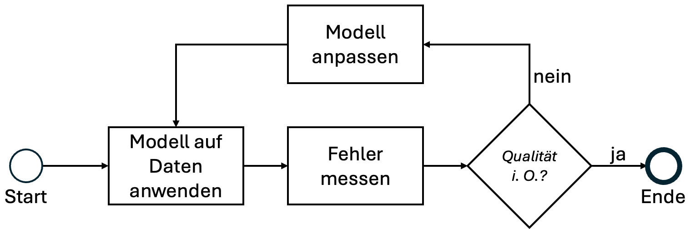
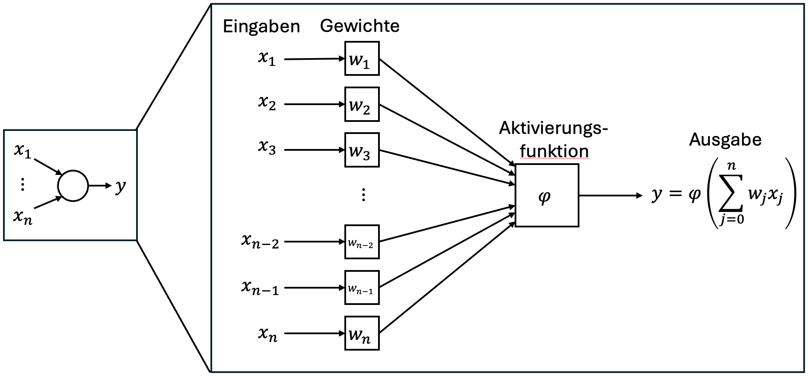
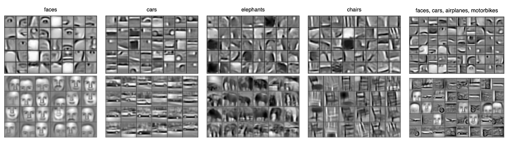

## Technische Grundlagen Künstlicher Intelligenz

_Skript zum Referat von Aleyna Soylu, Arvid Lepsien & Merve Örnek (gehalten am 19.05.2025)_

Wir müssen über _künstliche Intelligenz (KI)_ sprechen. Genauer genommen über KI-Modelle. Aber was war eigentlich nochmal ein Modell?
Ein Modell kann zum Beispiel so definiert werden:

> **Definition 1** _(Generischer Modellbegriff)_ Ein Modell ist ein wohlgeformtes, adäquates und verlässliches Instrument, das 'etwas' (genannt Herkunft als Quelle, Archetyp, Startpunkt) repräsentiert und in Anwendungsszenarien funktioniert.[^1]

Dieser Modellbegriff ist erstmal sehr abstrakt und schwierig greifbar.
Deshalb nehmen wir mit diesem Wissen für die späteren Erklärungen eine etwas konkretere Perspektive ein: Wir versuchen ein _System_ aus der _Realität_ in einem _Modell_ abzubilden. 
In der künstlichen Intelligenz nehmen wir dafür nicht irgendwelche Modelle, sondern KI-Modelle.
Unter diesem Modellbegriff lässt sich das Verhältnis von (KI-)Modell und Realität folgendermaßen schematisch darstellen:

Die Realität bzw. das System ist Vorbild für das Modell.[^2][^3]
Das Modell wiederum bildet das System ab.
Insofern das Modell das System abbildet, funktioniert es auch in Anwendungsszenarien -- zum Beispiel ermöglicht ein Wettermodell die Vorhersage von Temperaturen oder Regenfällen.  

Ja nach Definition wird das Verhältnis zwischen künstlicher und menschlicher Inelligenz unterschiedlich betrachtet.[^4]
Grunsätzlich lässt sich aber festhalten: KI-Modelle sind eine spezifische Gattung von Modellen, die (mindestens symbolisch) mit Intelligenz zusammenhängen.  

Um dieses Verhältnis zu klären -- oder überhaupt fundiert darüber diskutieren zu können -- werden zumindest grundlegende Einsichten in die technischen Hintergründe von KI-Modellen benötigt.
Der folgende Text setzt sich die Vermittlung dieser Grundlagen zum Ziel.
Wir beginnen mit den Grundbegriffen und erarbeiten uns dann ein Verständnis der Funktionsweise aktueller, komplexer KI-Modelle am Beispiel von Large Language Models.
Aufbauend darauf demonstrieren wir an beispielhaften Ansätzen, wie das technische Wissen in der philosophischen Betrachtung zur Anwendung kommen kann.  

---

[^1] Thalheim, B. (2022) _Models: the fourth dimension of computer science_. Software and Systems Modeling, 21(1). [doi:10.1007/s10270-021-00954-2](https://dx.doi.org/10.1007/s10270-021-00954-2)

[^2] Für unsere Zwecke soll es genügen, System und Realität gleichzusetzen.

[^3] Vgl. auch Prinz, A. et al. (2025) _Systems and Reality_ in: Understanding Modelling and Programming. Springer Nature, Cham. [doi:10.1007/978-3-031-71280-7_2](https://dx.doi.org/10.1007/978-3-031-71280-7_2)

[^4] Bringsjord, S. & Govindarajulu, N.S. (2024) _Artificial Intelligence_ in: The Stanford Encyclopedia of Philosophy. [Link](https://plato.stanford.edu/archives/fall2024/entries/artificial-intelligence/).

### Grundbegriffe

Zuerst wollen wir die relevanten Grundbegriffe klären.
Dazu sei kurz bemerkt:
Relevant ist ein Grundbegriff eben dann, wenn er für das Verständnis der späteren Inhalte wichtig ist.
Da der Fokus später auf Sprachverarbeitung mit LLMs liegt, blenden wir also einige Aspekte aus.
Das sind zum einen Aspekte, die heutzutage gar nicht mehr in der Forschung und Anwendung auftauchen -- zum anderen aber auch solche, die heutzutage zwar relevant sind, aber für andere Gebiete (z.B. Bildverarbeitung).

#### Künstliche Intelligenz

Als erstes soll kurz (!) festgehalten werden, was wir mit _künstlicher Intelligenz_ meinen.
Für detalliertere Ausführungen zur Herkunft von KI und Bestimmung des KI-Begriffs sei auf die unten aufgelisteten Quellen hingewiesen.[^1][^2][^3]
Definitionen von KI können beispielsweise in zwei Dimensionen organisiert werden.[^2][^3]

|            | Menschlich                         | Idealisierte Rationalität      |
|------------|------------------------------------|--------------------------------|
| Denkend    | Systeme, die wie Menschen denken.  | Systeme, die rational denken.  |
| Verhaltend | Systeme, die wie Menschen handeln. | Systeme, die rational handeln. |

Zum einen variieren die Definitionen bezüglich dessen, ob die KI _handeln_ oder eher _denken_ soll.[^4]
Zum anderen unterscheiden sie sich darin, ob das Ziel eine Annäherung an den Menschen ist oder eine idealisierte Form von Handeln bzw. Rationalität erreicht werden soll.
Diese Definitionen rücken andere vorstellbare Ziele wie die Erklärung von Phänomenen oder die Gewinnung von Wahrheiten in den Hintergrund, decken aber fast die gesamte KI-Literatur ab.[^2]
Auf den Zusammenhang zwischen System und Modell zurückblickend könnte man das Ziel von KI auch folgendermaßen fassen: Bestenfalls sollen uns KI-Modelle irgendwelche Aussagen/Ableitungen/Vorhersagen usw. über Systeme erlauben.

Die frühen Entwicklungen im Feld der künstlichen Intelligenz waren vor allem von _symbolischer KI_ geprägt.
Symbolische KI setzt algorithmisch das konzeptuelle Verständnis zur Lösung eines Problems um, das vorher von Menschen durch die Analyse des Problems erarbeitet wurde.

---

[^1] Kaplan, J. (2024) _Generative artificial intelligence: What everyone needs to know_. Oxford University Press.

[^2] Bringsjord, S. & Govindarajulu, N.S. (2024) _Artificial Intelligence_ in: The Stanford Encyclopedia of Philosophy. [Link](https://plato.stanford.edu/archives/fall2024/entries/artificial-intelligence/).

[^3] Russell, S. and Norvig, P. (2021) _Artificial Intelligence: A Modern Approach, 4th Global Edition_ Pearson Deutschland. S. 19-22. [Link](https://elibrary.pearson.de/book/99.150005/9781292401171).

[^4] Natürlich schließen sich Handeln und Denken nicht aus, es geht hier aber um das Ziel der KI-Entwicklung. Wenn eine KI denken könnte, könnte sie wahrscheinlich auch sinnvoll handeln...

#### Machine Learning

Mit der Zeit kam der symbolische Ansatz zur KI-Erstellung an seine Grenzen.[^1]
Während er sich für spezifische Probleme gut eignet, fehlt es schnell an Generalisierbarkeit selbst für nur leichte Veränderungen eines Problems.
Außerdem sind Problemstellungen ab einer bestimmten Komplexität zu umfangreich, als dass die Konzeptionierung durch Menschen in angemessener Zeit verlässlich alle ihre Spielarten erfassen und zweckdienlich modellieren kann.[^1]
Mit der Zeit hat sich so ein zweiter Ansatz zur Erstellung von KI-Modellen, das _maschinelle Lernen (ML)_, herausgebildet.[^2]
Beim maschinellen Lernen wird ein _Lernalgorithmus_ ausgeführt, der ein ML-Modell anhand eines Datensatzes _„trainiert"_.

Im Vergleich der Erstellungsweisen von klassischer symbolischer KI und ML-basierter KI sind die wichtigsten Unterschiede zwischen den beiden Ansätzen zu erkennen.
Symbolische KI entsteht, indem ein Mensch die Realität betrachtet, sie untersucht, daraus konzeptuelles Wissen gewinnt, und dieses Wissen programmatisch im Modell umsetzt.
Für das maschinelle Lernen dagegen wird eine Stichprobe des zu modellierenden Systems in Form von Daten erhoben und der Lernalgorithmus nutzt die Daten, um das Modell anzupassen.
Sprich: beim maschinellen Lernen wird der Mensch aus dem Modellierungsprozess herausgezogen.
Untersuchung und Erkenntnisbildung durch den Menschen werden ersetzt durch Datenerhebung und algorithmische Optimierung.
Wenn es um maschinelles Lernen geht müssen wir also unsere Vorstellung zum Verhältnis von System und Modell um den Intermediär „Daten" erweitern.
Dadurch verändert sich unsere zum Einstieg genutzte schematische Darstellung folgendermaßen:

Das Verhältnis zwischen Realität und Modell wird jetzt nicht mehr durch die menschliche Intelligenz sichergestellt.
Stattdessen besteht das Verhältnis nur noch mittelbar durch die Daten, und damit auch durch die Perspektive der Daten.
Wie werden also die Daten genutzt, um ein Modell der Realität anzunähern?

Typischerweise unterscheidet man zwischen drei zentralen _Lernparadigmen_:[^4]

- **Überwachtes Lernen (supervised learning)**: Es gibt einen Satz an _Trainingsdaten_, der aus Eingabe-Ausgabe-Paaren besteht. Ziel des Modells ist, die Ausgaben anhand der Eingaben zu rekonstruieren bzw. vorherzusagen.
- **Unüberwachtes Lernen (unsupervised learning)**: Hier sind im Gegensatz zum überwachten Lernen keine erwünschten Ausgaben vorhanden; das Ziel ist Muster in den Daten zu finden (z.B. Gruppen von ähnlichen Bildern).
- **Verstärkendes Lernen (reinforcement learning)**: Ein Agent wird in einer (simulierten) Umgebung eingesetzt und lernt anhand von Belohnungen und Bestrafungen.

Der typische Ablauf von maschinellem Lernen lässt sich als iterativer Zyklus beschreiben.[^5]
Zu Beginn wird ein minimales Basismodell (z. B. zufällig) angenommen.
Dieses Modell wird auf das vorliegende Problem angewandt und seine Ausgaben mittels eines _Qualitätsmesswerts_ beurteilt.
Solange die gewünschte Qualität noch nicht erreicht ist (oder eine vorher definierte maximale Zahl an Trainingszyklen) wird dann das Modell angepasst.
Damit wird seine „Strategie" der Problemlösung wird etwas angepasst.
Der Zyklus startet dann erneut mit dem angepassten Modells neu.
Wenn alles glatt läuft wird das Modell dadurch immer besser und erreicht eine zufriedenstellende Qualität.[^5]

An dieser Stelle sei nochmal explizit betont: Das fertige Modell entsteht algorithmisch aus den Daten und ohne Zutun des Menschen -- das ist ja auch der Grundgedanke des maschinellen Lernens.
Aber Achtung -- diese Trennung vom Menschen ist nicht ganz so stark, wie sie auf den ersten Blick scheint.
Auch wenn die konkrete Modellanpassung algorithmisch stattfindet, fließen trotzdem menschliche Entscheidungen und damit Konzeptionierungen ein.
Das ist zum Beispiel bei der Wahl des Modelltyps, der Art und Erhebung der Daten, der Zielsetzung und natürlich auch bei der Interpretation der Ausgaben der Fall.
Trotzdem gilt: In der Hauptsache wird das Modell mathematisch auf den Daten optimiert; es modelliert also vorrangig die Muster, die in den Daten auftreten.

**Nebenbei bemerkt**  

Die KI-Forschung hat schon erkannt, dass ML kein Allheilmittel ist -- und dass das unter anderem daran liegt, dass nur Muster und keine Konzepte algorithmisch „gelernt“ werden können.[^6]
Neuerdings versucht man also, symbolische und sog. sub-symbolische (z.B. neuronale) KI zu kombinieren.[^7]
Zur Erinnerung: Symbolische KI basiert auf expliziten Konzepten, die sich Menschen vorher erarbeitet haben.
Die Idee hinter solch einer Kombination kann man sich ungefähr wie das Zusammenspiel der zwei Denksysteme nach Kahneman[^8] vorstellen, also sub-symbolisch = schnell, intuitiv, unterbewusst und symbolisch = langsamer, explizit, abwägend und so weiter.[^9] 

---

[^1] Russell, S. & Norvig, P. (2021) _Artificial Intelligence: A Modern Approach, 4th Global Edition_ Pearson Deutschland. S. 696. [Link](https://elibrary.pearson.de/book/99.150005/9781292401171).

[^2] Bringsjord, S. & Govindarajulu, N.S. (2024) _Artificial Intelligence_ in: The Stanford Encyclopedia of Philosophy. [Link](https://plato.stanford.edu/archives/fall2024/entries/artificial-intelligence/).

[^3] Genau genommen ist maschinelles Lernen keine Ober- oder Teilmenge von KI, insbesondere gibt es grundsätzlich ML-Modelle, die keine KI-Modelle sind und andersherum genauso. Aufgrund der ubiquitären Nutzung von ML im Zuge von KI sind die Begriffe aber so verwachsen, dass sie in der Praxis nicht immer leicht zu unterscheiden sind.

[^4] Russell (2021) S. 671.

[^5] Kaplan, J. (2024) _Generative artificial intelligence: What everyone needs to know_. Oxford University Press. S.41f.

[^6] Sarker, M.K. et al. (2022) _Neuro-symbolic artificial intelligence: Current trends_ AI Communications, 34(3).

[^7] Hamilton, K. et al. (2024) _Is neuro-symbolic AI meeting its promises in natural language processing? A structured review_. Semantic Web, 15(4).

[^8] Kahneman, D. (2011) _Thinking, fast and slow._ New York City. Farrar, Straus and Giroux.

[^9] Aber Achtung, das Buch von Kahneman ist ja Populärwissenschaft ;)

#### Neuronale Netzwerke

Als nächstes betrachten wir eine wichtige -- wenn nicht momentan sogar die wichtigste -- Form Modell, die im maschinellen Lernen genutzt wird: sogenannte _neuronale Netzwerke (NN)_.[^1]
Wir erinnern uns: Ein zentrales Ziel der KI-Forschung ist und war, KI zu entwickeln, die menschliche Intelligenz nachahmt (simuliert, emuliert, reproduziert, überschreitet, ...).
Die menschliche Intelligenz wir am ehesten mit dem menschlichen Gehirn assoziiert.
Auf diesem Gedanken basiert die Idee der (künstlichen) neuronalen Netzwerke -- menschliche Intelligenz soll nachgeahmt werden, indem die Strukturen des Gehirns im KI-Modell nachempfunden werden.[^2]

Das menschliche Gehirn besteht aus einer großen Menge von miteinander verbundenen Neuronen, die Signale sammeln, kombinieren und weitergeben.[^2]

Das künstliche Neuron ist an das grundsätzliche Schema des biologischen Neurons im Sinne der Verarbeitungsstruktur _Signaleingänge-Signalkombination-Signalausgabe_ (links im Bild abstrakt, rechts im Bild etwas detaillierter) angelehnt.[^4]
Das künstliche Neuron erhält mehrere _Eingabesignale_ in Form von Zahlen, führt die _Signalkombination_ mittels einer Aktivierungsfunktion aus, und führt dann die _Signalausgabe_ aus, indem es den berechneten Wert über seine ausgehenden Kanten an die nächsten Neuronen weitergibt.[^2]
Jedes Verbindung, die in ein Neuron eingeht, erhält dabei ein spezifisches _Gewicht_, das bestimmt, wie sehr der Wert, der über diese Verbindung eingeht, in die Berechnung des Ausgabewertes einfließt.[^2]
Durch die Zusammensetzung dieser künstlichen Neuronen wird ein _neuronales Netzwerk_ konstruiert.[^4]
Gewissermaßen ist das neuronale Netzwerk damit ein Modell des menschlichen Gehirns, in dem biologische Neuronen untereinander verbunden sind und Signale austauschen.

Es hat sich die Konvention etabliert, neuronale Netzwerke grundsätzlich in Schichten zu strukturieren, sodass die Neuronen in einer Schicht immer die Werte von der vorherigen Schicht als Eingänge erhalten und ihre Ausgabewerte an die nachfolgende Schicht weitergetragen werden.[^4][^5]
Typischerweise wird zwischen der Eingabeschicht, der Ausgabeschicht und sog. _Hidden Layers_ (Versteckte Schichten) unterschieden.[^2]
Im Bild ist ganz links die Eingabeschicht, in die die rohen Daten eingegeben werden, ganz rechts die Ausgabeschicht, nach der das Ergebnis entnommen wird und in der Mitte ein _Hidden Layer_, der zwischen Eingabe- und Ausgabeschicht vermittelt.
Ein Hidden Layer ist also in dem Sinne _versteckt_, dass man bei der Interaktion mit der Blackbox „neuronales Netzwerk" mit ihm nicht in Berührung kommt.[^6]
Gibt man Daten in ein neuronales Netz ein, dann können Schritt für Schritt (bzw. Schicht für Schicht) die Ausgabewerte der Neuronen aus ihren Eingabewerten berechnet werden.[^2][^7]

Wir wollen noch kurz betrachten, wie das „Lernen" bei neuronalen Netzwerken umgesetzt wird.
Das Schema zur Modellanpassung ist prinzipiell gleich zum maschinellen Lernen, einfach schon weil NN eine Unterart von ML-Verfahren sind.[^8]
Es wird also ein Datensatz genutzt, das Modell darauf angewandt.
Dann wird die Qualität der Ausgaben des Modells berechnet.
Dafür benutzt man eine sog. „Loss-Funktion", die die Magnitude der Abweichungen zwischen den Ausgaben des Modells und den aus den Testdaten bekannten korrekten Werten misst (zum Beispiel den mittleren Quadratfehler).[^8]
Die Fehlerwerte werden dann genutzt, um die Parameter des Netzes anzupassen, mit dem Ziel den Wert der Loss-Funktion zu minimieren.
Wie genau diese Optimierung stattfindet braucht uns an dieser Stelle nicht zu interessieren -- wir stellen bloß fest: das „Lernen" des neuronalen Netzwerks ist technisch betrachtet eine mathematische Optimierung.[^9]

---

[^1] Vgl. Kinnebrock, W. (1994) _Neuronale Netze: Grundlagen, Anwendungen, Beispiele_. R. Oldenbourg Verlag.  

[^2] Kaplan, J. (2024) _Generative artificial intelligence: What everyone needs to know_. Oxford University Press. S.39f.

[^3] Bildquelle: [Wikimedia](https://commons.wikimedia.org/w/index.php?title=File:Complete_neuron_cell_diagram_de.svg&oldid=866756726)

[^4] Russell, S. & Norvig, P. (2021) _Artificial Intelligence: A Modern Approach, 4th Global Edition_ Pearson Deutschland. S. 801ff. [Link](https://elibrary.pearson.de/book/99.150005/9781292401171).

[^5] Diese Konvention ist natürlich nicht verbindend, vereinfacht aber drastisch den Berechnungsaufwand. So können effizienter komplexere Netzwerke ausgeführt werden. Die Praxis zeigt, dass in vielen Fällen die Möglichkeit, größere Netzwerke zu nutzen, die strukturellen Einschränkungen dieser Konvention in Bezug auf die Qualität der Modellergebnisse mehr als nur ausgleichen. Andersherum gibt es auch Fälle, wo Quer- oder Rückverbindungen notwendig oder zumindest zweckdienlicher sind.

[^6] Es können -- wie wir gleich sehen werden und anders als im Beispiel hier -- auch mehrere Hidden Layer aufeinander folgen. Der wichtige Punkt ist: Nur aus der Interaktion mit der KI können wir nicht wissen, wie viele Hidden Layer es gibt und wie sie aussehen bzw. strukturiert sind.

[^7] Wir schieben die Daten „vorwärts" (in Richtung des Ergebnisses) durch das Netz, sprich: _Forward Propagation_

[^8] Russell (2021) S. 805ff.

[^9] Es sei dazu nur soviel gesagt, dass der Fehler, der ja an der Ausgabe berechnet wird, von rechts nach links -- also _rückwärts_ im Netzwerk -- zurückverfolgt wird, sprich: _Backward Propagation_

#### Deep Learning

Die ersten Versuche mit neuronalen Netzen, z.B. Perzeptrons, sind schnell an ihre Grenzen gelangt.
Man konnte einfache Probleme (lineare Regression) mit ihnen lösen, bei komplexeren Problemen (nichtlineare Probleme oder Probleme die Abstraktion benötigen) scheiterten sie aber.
Um komplexere Probleme zu lösen wurde _Deep Learning (DL)_ entwickelt.[^1]

Im Grunde ist die Idee wieder recht einfach: Die neuronalen Netzwerke haben -- im Vergleich zu den vorherigen, „flachen" Netzwerken -- eine große Zahl von aufeinander folgenden Hidden Layers.[^2]
Mit „deep" ist also tatsächlich gemeint, dass Schichtenstruktur der Netzwerke immer tiefer und tiefer geworden ist.

So ein Modell hat ersichtlich deutlich mehr Neuronen und Gewichte -- sprich Parameter -- und auch deutlich mehr Möglichkeiten zur Kombination von Signalen.
Auf der einen Seite kann es also deutlich komplexere Systeme modellieren.
Auf der anderen Seite sind dafür aber auch komplexere Optimierungsverfahren und deutlich mehr Rechenleistung notwendig.
Dieser verstärkte Bedarf erklärt auch zum Teil die rasante Entwicklung von KI in den letzten Jahren.[^3]

Bestenfalls wird ein Deep-Learning-Modell nun so „gelernt", dass es -- ähnlich zur strukturierten Herangehensweise eines Menschen -- ein komplexes Problem in immer kleinere und weniger komplexer Teilprobleme auflöst.[^2]
Irgendwann sind die Teilprobleme (der Teilprobleme der Teilprobleme...) so klein, dass sie einfach gelöst werden können.
Und dann werden die Teillösungen quasi rückwärts wieder zu einer Lösung für das gesamte Problem zusammengesetzt.
Kurz: Die Hoffnung von Deep Learning ist, automatisch auch eine abstrakte Strukturierung der Probleme zu lernen -- sich also an die menschliche Konzeptionierung anzunähern.  

Am Beispiel einer Handschrifterkennung könnte das so aussehen:

Man kann sich einen idealisierten Verarbeitungsablauf so vorstellen, dass in der Eingabeschicht die sehr konkreten und feingranularen Daten (hier Pixel) eingegeben werden.
Im Verlauf der aufeinander folgenden Schichten (Hidden Layer) werden die Pixel immer weiter zu abstrakteren Repräsentationen zusammengesetzt.
Zum Beispiel könnte das Netz erst Kanten identifizieren.
Aus den Kanten werden dann größere Formen zusammengesetzt.
Die Formen ergeben zusammen ein Schriftzeichen.
In der Ausgabeschicht wird das Schritzeichen dann ins Ausgabeformat umgesetzt: Das Netz „erkennt" die Ziffer 9 und gibt diese „Information" aus.  

Es wird also Schritt für Schritt die Granularität der Eingaben auf ein abstrakteres Niveau gehoben, um zum finalen Ergebnis zu kommen.
Dieses idealisierte Konstruieren von Objekten aus Strukturen (aus Mustern aus Formen usw.) durch das hierarchische Anheben der Granularität wirkt augenscheinlich wie eine _intelligente_ Abstraktionsleistung zur strukturierten Problemlösung.
Und natürlich ist das obige Beispiel idealisiert -- im Prinzip lässt sich diese schrittweise Abstraktion aber auch bei tatsächlichen Deep-Learning-Modellen, die mittels echter Daten erstellt wurden, erkennen.[^4]
Zur Untersuchung dieses Phänomens kann man Visualisierungen der Modellgewichte erstellen, die zeigen, welche Regionen für die jeweiligen Schichten/Neuronengruppen besonders relevant sind.

In der Visualisierung einiger Gewichte in einem Bilderkennungsmodell lassen sich relevante Strukturen der jeweils zu erkennenden Objekte erkennen.
Die obere Reihe in der Grafik sind kleinere Strukturen, zum Beispiel Augen, zu erkennen.
In der unteren Reihe kann man erkennen, wie diese Strukturen zu Teilen von komplexen Objekten geworden sind.

Mit immer größeren und komplexeren Modellen wurde irgendwann der Punkt überschritten, an dem das Vorgehen der Modelle tatsächlich noch so anschaulich visualisierbar und dadurch auch nachvollziehbar war.
Als Markierung der Überschreitung dieser Grenze wird oft das Bilderkennungsmodell _AlexNet_ genannt, das 2012 veröffentlicht wurde.[^5]

> »[...] Was für ein Dummkopf!«  
> »Wer?«  
> »Ich. [...]« [^6]

Aber selbst wenn es funktioniert, das strukturierte und abstrakte Vorgehen des Menschen nachzuahmen, gibt es einen entscheidenden Unterschied:
Der Mensch kann das Problem nicht einfach nur lösen, sondern auch seine Herangehensweise eigenständig reflektieren.
Diese Metaebene der Problemlösung bleibt dem Deep-Learning-Modell verschlossen.

---

[^1] Krohn, J., Beyleveld, G., & Bassens, A. (2020) _Deep Learning illustriert_. dpunkt.verlag.

[^2] Russell, S. & Norvig, P. (2021) _Artificial Intelligence: A Modern Approach, 4th Global Edition_ Pearson Deutschland. S. 801ff. [Link](https://elibrary.pearson.de/book/99.150005/9781292401171).

[^3] Das [Moore'sche Gesetz](https://de.wikipedia.org/wiki/Mooresches_Gesetz) besagt, dass sich die verfügbare Rechenleistung etwa alle 1-2 Jahre verdoppelt -- also exponentiell wächst. Mit ihr wächst auch etwa die Komplexität und Leistungsfähigkeit von KI-Modellen. (Vgl. auch Kaplan 2024, S. 24f)  

[^4] Lee, H. et al. (2009) _Convolutional deep belief networks for scalable unsupervised learning of hierarchical representations_. ICML ‘09

[^5] Krizhevsky, A., Sutskever, I. & Hinton, G.E. (2012) _ImageNet Classification with Deep Convolutional Neural Networks_ NEURIPS '12. [Link](https://proceedings.neurips.cc/paper_files/paper/2012/file/c399862d3b9d6b76c8436e924a68c45b-Paper.pdf).

[^6] Eco, U. (1986) _Der Name der Rose_. dtv. S. 597.

### Large Language Models

Ein wichtiges Ziel von KI-Forschung ist die Verarbeitung menschlicher bzw. natürlicher Sprache (im Fachjargon _NLP_ für _Natural Language Processing_).
Das zentrale Problem dabei ist, dass sich natürliche Sprache fundamental von der formalen „Sprache" der Computer unterscheidet.

|              | Natürliche Sprache                     | Datenverarbeitung/Programmierung    |
|--------------|----------------------------------------|-------------------------------------|
| Konstitution | Wandelbar                              | Statisch definiert                  |
| Kontext      | Abhängig                               | Entkoppelt                          |
| Ausprägung   | Individuell                            | Standardisiert                      |
| Symbole      | Zeichen, Begriffe, Konzepte, Prädikate | Mathematische und logische Zustände |

Bereits anhand einer kurzen Gegenüberstellung einiger Eigenschaften wird klar, dass zwischen der sprachlichen Praxis von Mensch und Computer eine große Schlucht klafft.
Folglich wollen wir betrachten, wie moderne Ansätze versuchen, diese Schlucht zu überbrücken.

Der aktuell dominierende Ansatz zur Verarbeitung natürlicher Sprache sind sogenannte _Large Language Models (LLMs, dt. etwa „große Sprachmodelle")_.[^1]
Mit „Large" ist dabei tatsächlich die Größe der Modelle gemeint.
Die oben für neuronale Netze gezeigten Beispielbilder zeigen Netzwerke mit nur wenigen Neuronen und entsprechend auch einer geringen Anzahl an Verbindungen (inkl. Kantengewichte).
Das heißt, sie haben wenige _Parameter_ (in der Größenordnung bis einige hunderte).[^2]
Selbst vergleichsweise (!) simple Versionen von LLMs haben bereits mehrere **Milliarden** Parameter.

Der Verarbeitungsablauf von LLMs, also der Weg von der Eingabe (typischerweise in Form von Texten) bis zur Ausgabe (i.d.R. eine Vorhersage des nächsten Wortes[^3]), lässt sich grob in drei Schritte aufteilen.[^4]
Zuerst durchläuft die Eingabe eine sog. _Tokenisierung_.[^4]
Die tokenisierte Eingabe (kurz: die Token) wird dann im _Embedding_-Schritt in einen Vektorraum eingebettet, d.h., eine Liste von Token wird zu einer Liste von Vektoren -- also einer Matrix.[^4]
Die resultierende Matrix wird dann mit sog. _Transformern_ verarbeitet.[^5]
Schließlich kann aus der transformierten Matrix die Ausgabe, in etwa eine Vorhersage für das nächste Wort, abgeleitet werden.[^4]
Im Folgenden werden diese Schritte und ihre Funktionsweise näher beleuchtet.

---

[^1] Kaplan, J. (2024) _Generative artificial intelligence: What everyone needs to know_. Oxford University Press. S. 38.

[^2] Man kann sich den Begriff _Parameter_ auch so vorstellen, dass jeder Parameter eine einzelne Stellschraube ist, die bei der Modellanpassung verändert werden kann.

[^3] Kaplan (2024) S. 52.

[^4] Kaplan (2024) S. 4f.

[^5] Kaplan (2024) S. 30.

[^6] Kaplan (2024) S. 43ff.

#### Tokenisierung

Der erste Verarbeitungsschritt eines LLMs ist die sogenante _Tokenisierung_.[^1]
Die Aufgabe dieses Schrittes ist die Umwandlung der Sprachhandlung in eine maschinenlesbare Form.[^1]
Normalerweise liegt ein Abbild der Sprachhandlung in Form eines digitalen Textes vor.
Die Umwandlung ist also nicht nur _Datifizierung_[^2], sondern vielmehr auch Strukturierung für die spezifische Aufgabe „Maschinelles Textverständnis“.
Die Eingabe wird umgewandelt, indem sie zuerst einzelne Einheiten -- die _Token_ -- aufgeteilt wird.[^3]
Danach werden die Token anhand einer vordefinierten, _eineindeutigen_[^4] Zuordnung in Zahlen umgewandelt.[^3]

Grundsätzlich werden Tokenizer auf der technischen Ebene als feste, vordefinierte Programme umgesetzt[^3], und basieren entsprechend auf manuell ausgewählten Regeln und Erfahrungen.
Das heißt, dass im Entwurf des LLMs schon eine Entscheidung getroffen wird, was sinnvolle atomare Einheiten sind, in die die Sprache zerteilt werden soll.
Man kann sich viele verschiedene Ansätze für diese Auftrennung ausdenken, etwa die Auftrennung von Texten in ganze Worte (also bei den Leerzeichen), Gruppen mit einer festen Anzahl von aufeinander folgenden Buchstaben und so weiter.
Die aktuell verwendeten Tokenizer basieren auf etwas komplexeren Strategien, die durch iterative Entwicklung (im Grunde Trial and Error) immer weiter so verbessert wurden, dass sie möglichst gute Ergebnisse ermöglichen.[^5]
Im Detail unterscheiden sich die Tokenizer verschiedener LLMs in der Regel[^3]; bedingt durch die fortlaufende Weiterentwicklung gibt es sogar innerhalb einer Modellfamilie immer wieder Unterschiede in der Tokenisierung.[^6]

**Beispiel**  

Nehmen wir einen -- recht bekannten -- Beispielsatz:

> „Handle nur nach derjenigen Maxime, durch die du zugleich wollen kannst, dass sie ein allgemeines Gesetz werde.“ (Kant: AA IV, 420)

Wir können diesen Satz in einen Tokenizer eingeben, um die Aufteilung des Textes und die Umwandlung in Zahlen (Token-IDs) nachzuvollziehen.[^6]

Wie man sieht wurden die meisten Worte im Ganzen tokenisiert.
Einige Worte, zum Beispiel _Maxime_, wurden in mehrere Token aufgespalten.
Nachdem die Worte in Token aufgeteilt sind können die erfassten Token zu Zahlen umgewandelt und abgespeichert werden.
Für unser Beispiel sieht das folgendermaßen aus:

Wir sehen, dass jedes Token durch eine Zahl ersetzt wurde.
Der Satz ist also zu einer Liste von Zahlen umgewandelt worden.
Man kann auch die Eindeutigkeit der Zuordnung zwischen Token und Zahl erkennen -- wenn in der Eingabe wiederholt (oder auch, wenn dasselbe Token bei einer anderen Eingabe auftaucht) wird diesem immer dieselbe Zahl zugeordnet.[^4]
Beim Beispielsatz zeigt sich das am Token für das Komma, das an zwei Stellen jeweils in die Zahl 11 umgewandelt wurde.

---

[^1] Kaplan, J. (2024) _Generative artificial intelligence: What everyone needs to know_. Oxford University Press. S. 38.

[^2] _Vgl.:_ Feige, D. M. (2025) _Kritik der Digitalisierung. Technik, Rationalität und Kunst._ Felix Meiner Verlag. S.42ff.

[^3] Kaplan (2024) S. 52.

[^4] Sprich: zu jedem Token gibt es genau eine Zahl und es passiert auch nicht dass zwei unterschiedliche Token dieselbe Zahl zugeordnet bekommen. So wird sichergestellt, dass Listen von (validen) Token auch wieder zu Texten zurückübersetzt werden können.

[^5] Nair, S & Resnik, P. (2023) _Words, Subwords, and Morphemes: What Really Matters in the Surprisal-Reading Time Relationship?_. EMNLP 2023. [10.18653/v1/2023.findings-emnlp.752](https://doi.org/10.18653/v1/2023.findings-emnlp.752)

[^6] _Für die Erstellung des Beispiels wurde der [OpenAI Tokenizer](https://platform.openai.com/tokenizer) in der Version für GPT-4o & GPT-4o mini am 16.05.2025 genutzt._

#### Embedding

Ein Embedding ist die rechnerische Einbettung von Sprache in einen hochdimensionalen Vektorraum, in dem Token nicht mehr nur einzelne Zahlen (IDs) sind, sondern ihre Positionen im Vektorraum mathematisch ihre Bedeutung verorten.[^1]
Ziel dabei ist, die Semantik von Wörtern durch Zahlen darstellbar zu machen.[^2]
Zur Erstellung eines Embedding wird der Kontext aller möglichen Tokens systematisch in großen Textmengen analysiert.[^2]
Das Embedding analysiert also die Kontexte, in denen die Token _typischerweise_ vorkommen.[^2]
Das heißt, dass im Embedding die _allgemeine_ Bedeutung der Token erfasst wird.

Die einzelnen Werte (bzw. Dimensionen) der Vektoren kann man sich -- räumlich gesprochen -- auch als eine Art Bedeutungsdimensionen vorstellen.[^2]
Zum Beispiel sind die Wortfolgen _Zimmer - Wohnung - Haus - Palast_ und _Pfütze - Teich - See - Ozean_ also -- mutatis mutandis -- in ihrer Anordnung in der Bedeutungsdimension „Größe" gleich.[^2]
In tatsächlich verwendeten Embeddings entsprechen die Bedeutungsdimensionen nicht unbedingt menschlich verständlichen Konzepten.[^2]
Das ändert aber prinzipiell nichts daran, dass in jeder Dimension ein mehr oder weniger eines Teils der Wortbedeutung gemessen wird.
Alle Dimensionen des Vektors zusammengenommen erfassen so die gesamte typische Bedeutung des Tokens.

Durch die Umrechnung in einen Vektor und damit auch die Verortung der Bedeutung im (hochdimensionalen) Vektorraum wird es möglich, mit Tokens und ihren Bedeutungen zu rechnen.[^2]
Tatsächlich ist es so, dass zwei Worte mit ähnlicher Bedeutung vom Embedding auch an ähnlicher Stelle im Vektorraum verortet werden.[^4]
Die Ähnlichkeit in der Bedeutung kann tatsächlich als (Kosinus-)Ähnlichkeit der Vektoren berechnet werden (Rose ist ähnlich zu Blume, Lilie usw.).

Im obigen Bild ist das Ergebnis einer Analogie-Rechnung mit Hilfe eines Embeddings dargestellt.[^3]
Durch das Rechnen mit den Vektoren lässt sich feststellen, dass „Schall" zu „Ohr" steht wie „Strahl" zu „Auge".
Diese Untersuchung der Beziehungen von Worten untereinander taucht übrigens als typische Frage zu _Wortanalogien_ oft auch in Intelligenztests auf.

Abschließend seien an dieser Stelle noch zwei typische Herausforderungen von Embeddings erwähnt.
Erstens haben Embeddings Schwierigkeiten mit Polysemie, also mit Worten, die mehrere getrennte Bedeutungen einnehmen können.[^4]
Ein naheliegendes Beispiel ist die _Bank_, die etwa im Park stehen kann oder auch ein Geldinstitut sein könnte.
Zweitens sind Antinomien -- also Gegenteile -- schwierig in Vektorraum-basierten Embeddings zu erfassen.[^5]
Etwa sind Tag und Nacht intuitiv polare Gegenteile[^6], ihre Vektoren im Embedding könnten sich aber trotzdem sehr ähnlich sein, weil es sich bei beiden z.B. um Zeiten handelt und sie in Texten sehr oft zusammen auftauchen.

---

[^1] Kaplan, J. (2024) _Generative artificial intelligence: What everyone needs to know_. Oxford University Press. S. 38.

[^2] Kaplan (2024). S. 4f.  

[^3] Kaplan (2024). S. 34f.

[^4] [https://vectors.nlpl.eu/explore/embeddings/en/calculator/](https://vectors.nlpl.eu/explore/embeddings/en/calculator/)

[^5] Fodor, J. et al. (2023) _The Importance of Context in the Evaluation of Word Embeddings: The Effects of Antonymy and Polysemy_ in: Proceedings of the 15th International Conference on Computational Semantics.

[^6] Man sagt ja auch: „Ein Unterschied wie Tag und Nacht"

#### Transformer

Der dritte Verarbeitungsschritt im LLM ist der _Transformer_.
Die Transformer-Architektur wurde 2017 von Vaswani et al.[^1] als neuartige Modellarchitektur zur Verarbeitung von Sequenzdaten eingeführt.
Alleine die Zitationszahlen der dazugehörigen Veröffentlichung mit dem Titel „Attention is All You Need" zeigen, wie bahnbrechend der Transformer-Ansatz war und immer noch ist: In den knapp 8 Jahren zwischen der Veröffentlichung jenes Papers und dem Verfassen dieses Textes[^2] hat alleine jenes einzelne Paper laut Google Scholar über 180000 Zitationen gesammelt.

Zentral für die Funktionsweise des Transformers ist die Idee der sog. _„Attention"_.[^1][^3]
Anstatt wie in vorherigen Ansätzen zur Verarbeitung von sequentiellen Daten die Abhängigkeiten dadurch zu modellieren, dass stumpf eine bestimmte Menge an vorherigen Eingaben (z.B.: die 100 Wörter vor dem aktuell betrachteten) in einem naiven _Kontextfenster_ vorgehalten und in die Verarbeitung mit einbezogen werden, wählen Transformer „selbst"[^4] die Teile des Kontexts, die für die folgende Verarbeitung vorgehalten werden sollen.[^5]
Die Self-Attention-Module im Transformer betrachten für
In modernen LLMs werden die Transformer so aufgebaut, dass jeder Vektor nur von den vorangehenden Vektoren beeinflusst werden kann.[^6][^7]
Etwas vereinfacht gesprochen könnte man sagen, dass in die Vorhersage eines Wortes nur die vor diesem Wort ausgesprochenen Worte eingehen.[^8]

Danach werden im Transformer die Kontexte der einzelnen Vektoren in der Eingabematrix (zu Beginn sind das die Embedding-Vektoren der Eingabetoken) in genau dieser Vektoren eingerechnet.[^7][^9]
Das heißt, die Vektoren werden in Abhängigkeit von ihrem Kontext angepasst; es wird sozusagen die im Embedding gefasste Bedeutung der Token innerhalb des Sprechakt-Kontextes präzisiert.[^7]
Die Matrix wird also (und daher kommt auch die Benennung) so _transformiert_, dass die Vektoren ausgehend von der allgemeinen Bedeutung der Token zu ihrer aktuellen Bedeutung (immer noch gefasst durch die generellen Bedeutungsdimensionen des Embeddings, dann aber mit aktualisierten/veränderten Werten) wandern.[^7]
In der Regeln wird diese Transformation mehrfach wiederholt, wobei die Matrix immer weiter transformiert wird.[^6]

Schlussendlich wird anhand der transformierten Matrix das nächste Token vorhergesagt, welches dann wieder in ein Wort bzw. Wortteil umgerechnet werden kann.[^7]

---

[^1] Vaswani, A. et al. (2017) _Attention is All You Need_. NEURIPS'17.

[^2] Also bis zum 18.05.2025

[^3] Die Autoren von Vasvani (2017) behaupten ja sogar, dass Attention alles ist, was man benötigt ;)

[^4] Achtung: Natürlich müssen wir etwas Vorsicht dabei walten lassen, Begriffe wie „wählen" und "selbst" auf KI-Modelle anzuwenden. An dieser Stelle wollen wir aber diese (in der Literatur durchaus nicht unübliche) Formulierung wählen, weil sie den Gedanken hinter den allgemein anerkannten Fachbegriffen besser beleuchten. (Natürlich ist aber auch der Begriff der „Attention", also „Aufmerksamkeit" nicht unproblematisch...)

[^5] Kaplan, J. (2024) _Generative artificial intelligence: What everyone needs to know_. Oxford University Press. S. 43f.

[^6] Russell, S. & Norvig, P. (2021) _Artificial Intelligence: A Modern Approach, 4th Global Edition_ Pearson Deutschland. S. 919-923. [Link](https://elibrary.pearson.de/book/99.150005/9781292401171).

[^7] Kaplan (2024) S.50.

[^8] Um das Referat und den Text nicht mit technischen Details zu überfrachten, haben wir Themen wie _Multi-Head Attention_ und _Positional Embeddings_ übergangen. Kurz zusammengefasst kann man sagen, dass in modernen LLMs mehrere verschiedene Attention-Interpretationen parallel laufen (anschaulich gesprochen: weil ja die Relevanz der Wörter untereinander auch variiert, welchen Aspekt des Kontextes wir untersuchen) und in der Verarbeitung auch Informationen über die Positionen der einzelnen Token (absolut und relativ) mitbetrachtet werden  (vgl. Russell 2021, S. 920f).

[^9] Deshalb spricht man auch von _„Self-Attention"_ -- nämlich weil der Transformer selbst den einzurechnenden Kontext bestimmt und auf die Eingabe selbst (und nicht etwas separates) anwendet.

### Diskussion

Zur Demonstration davon, wie oben aufgearbeiteten technischen Grundlagen in der philosophischen Betrachtung von KI eingesetzt werden können, werden diese im Folgenden in drei Ansätzen angewandt.
Zuerst betrachten wir, was wir aus der Architektur von LLMs über ihr mögliches Sprachverständnis lernen können.
Danach wird der Gebrauch von anthrophomorphisierenden Bezeichnungen im Bereich der KI kritisch beleuchtet.
Schlussendlich wollen wir noch kurz auf die scheinbare Emergenz von komplexen „Fähigkeiten" bei LLMs, die beim Überschreiten einer gewissen Komplexitätsschwelle augenscheinlich plötzlich auftreten, eingehen.

#### LLMs und Sprache

> »Du willst mir voller Stolz erklären, wie du auf mich gekommen bist, indem du dich an deine Ratio gehalten hast, und dabei sagst du mir, daß du ans Ziel gelangt bist, indem du eine falsche Fährte verfolgt hast. Was willst du mir damit klarmachen?«
»[…] das spielt keine Rolle, denn eins steht fest: Ich bin hier.« [^1]

Für die Untersuchung von LLMs in Bezug auf ihr Sprachverständnis dient sich eine _semiotische_ Lupe an.
Mit Semiotik wird gemeinhin die Wissenschaft benannt, die sich im allgemeinen mit Zeichen, spezifisch also zum Beispiel mit Wörtern und Sprache beschäftigt.
Klassisch ist die Semiotik in drei Teile geteilt: die Syntaktik, die Semantik und die Pragmatik.
Die Syntaktik befasst sich mit der Beziehung von Zeichen untereinander, die Semantik mit der Beziehung von Zeichen zu Objekten und die Pragmatik mit der Beziehung von Zeichen zu den Kommunikationsteilnehmern.[^2][^3]

Das Pferd von hinten aufzäumend stellen wir fest, dass sich die Verarbeitungsschritte von LLMs auf ebendiese Dreiteilung der Semiotik abbilden lassen.

Ohne weitere Umschweife soll nun auf die einzelnen Zuordnungen und die Erkenntnisse, die wir daraus über den Umgang von LLMs mit Sprache gewinnen können, im Detail eingegangen werden.

**Tokenisierung**  

Zuerst kommen wir also zur Frage wie der Tokenisierungs-Schritt in Bezug auf Sprache eingeordnet werden kann.
Man könnte sagen, dass die Tokenisierung darauf abzielt, den Text in kleinste bedeutungstragende Einheiten (Token) aufzuteilen und durch die Umwandlung in Listenform auch eine Strukturierung ihres Zusammenhangs bewirkt.
Die Token sind also Symbole, die (hoffentlich!) auf irgendeine Bedeutung zeigen, und die strukturierte Listendarstellung eröffnet die Möglichkeit, algorithmisch den Zusammenhang der Symbole untereinander zu untersuchen.
Die konkreten Zahlenwerte haben dabei jedoch erstmal keine besondere Bedeutung (d.h., der Zahlenwert eines Tokens trifft keinerlei Aussage über den Inhalt oder die Bedeutung eines Tokens) und sind reines Mittel zur Verarbeitung.
Das heißt: Die Tokenisierung arbeitet am ehesten auf der Ebene der Syntaktik -- oder sie arbeitet mindestens der syntaktischen Betrachtung zu.

Man könnte auch auf die Idee kommen, dass eine sinnvollere Tokenisierung auf Grundlage der Erkenntnisse der Sprachwissenschaft möglich wäre, zum Beispiel indem man eine Aufteilung in Morpheme als kleinste sinntragende Einheiten der Sprache vornimmt.
Tatsächlich ist es jedoch so, dass eine -- dann ja immerhin linguistisch fundierte -- Tokenisierung in Morpheme keinen signifikanten Unterschied in der Ergebnisqualität von Sprachmodellen macht.[^4]

**Embedding**

Betrachten wir nun als nächstes den Embedding-Schritt.
Das Embedding versucht, durch eine Analyse des Kontext von Token eine Rekonstruktion ihrer Bedeutung vorzunehmen.
Die Betrachtung des Kontext von Token lässt sich auch als Untersuchung der Interaktion zwischen Symbolen und anderen Symbolen charakterisieren.
Das Embedding zielt also auf die Semantik ab.
Die typische Struktur des Embedding-Schritts beinhaltet ein Verständnis von Semantik, das von John R. Firth folgendermaßen auf den Punkt gebracht wurde:

> „You shall know a word by the company it keeps.“[^5]

Dieses Semantikverständnis wird als _distributionelle Semantik_ bezeichnet.
Die grundlegende _distributionelle Hypothese_ behauptet, dass Wörter, die in denselben Kontexten genutzt werden und auftreten, auch ähnliche Bedeutungen haben @ref(harris1954).
Diese implizite Annahme einer distributionellen Semantik ist grundsätzlich nicht vollkommen abwegig, eben weil sie sich theoretisch fundieren lässt, und sich auch in der technischen Praxis als probates Mittel bewiesen hat.
Kaplan (2024) veranschaulicht dieses Semantikverständnis mit einem Beispiel: Wenn man die Bedeutung eines Wortes nicht kennt, dann schlägt man diese in einem Wörterbuch nach, wo seine Bedeutung durch andere Worte erklärt wird. 
Andererseits ist die distributionelle Sichtweise nicht die einzig mögliche Konzeption von Semantik.
Und sie erhebt diesen Anspruch auch gar nicht.
Zum Beispiel stellt Harris[^6] ganz im Gegenteil explizit klar:

> „It goes without saying that other studies of language -- historical, psychological, etc. -- are also possible, both in relation to distributional structure and independently of it.“ 

Es ist also völlig unstrittig, dass die distributionelle Semantik neben ihren Stärken auch Schwächen hat und in Bezug auf manches an ihre Grenzen gelangt.
Problematisch wird es zum Beispiel in Bezug auf Embodiment (und damit die Fundierung in der Realität), Komposition (nur weil ich weiß, was „tot“ und „Oma“ bedeuten, garantiert das nicht, dass ich weiß, was eine „tote Oma" ist), Homonymie, Polysemie und vieles weiteres.
Indem die Architektur von LLMs sich die distributionelle Semantik zu eigen macht, macht sie sich natürlich auch deren Probleme zu eigen.
Ob das in der allgemeinen Präsentation von LLMs -- insbesondere durch Unternehmen, die LLMs als Produkte vermarkten -- ausreichend anerkannt wird muss jede:r selbst beurteilen.

**Transformer**

Im Transformer-Schritt von LLMs wird der _aktuelle_ Sprechakt in die Bedeutungsdimensionen der vorher vektorisierten Token eingearbeitet.
Die Bedeutung wird hier also im Lichte des Kontexts analysiert und folglich arbeitet dieser Schritt auf der Ebene der Pragmatik.
Hier zeigt sich schnell eine Herausforderung für LLMs: Der Kontext des Sprechakts ist nicht (nur) der Sprechakt selbst.

> Der Leser ist unmittelbar, ohne Vermittlung durch die Inhalte, mit der Tatsache in Berührung gekommen, daß es unmöglich ist, nur eine Geschichte zu haben.[^7]

Vielmehr spielen Faktoren wie Körperlichkeit (Embodiment), Emotionen, soziale Gefüge, Intentionen usw. herein.
Alle diese Faktoren fehlen dem Modell -- es kann diese Arten von Kontext überhaupt nicht berücksichtigen, und deshalb auf der pragmatischen Ebene auch nur sehr begrenzt arbeiten.

Betrachten wir etwa ein Beispiel zur Intentionalität.
Grice bemerkt, dass Bedeutung eben auch davon abhängig ist, was der Sprechende zu kommunizieren intendiert.[^8]
Etwas anschaulicher könnte man sich überlegen, was vernünftigerweise auf die Frage „Kannst Du mir das Salz geben?" folgen sollte.
Ein Mensch erkennt die Intention des Fragenden, sagt „Gerne doch!" und reicht das Salz herüber.
Mit einer Antwort wie „Ja, ich besitze diese Fähigkeit." hingegen würde der Antwortende entweder die Intention des Fragenden missverstehen oder ironisch mit dieser umgehen.
Durch das Fehlen der Intentionsperspektive ist diese Unterscheidung für ein LLM nicht möglich.
Wohl könnte es passieren, dass eine Antwort simuliert wird, die den Anschein erweckt, dass die Intention durch das LLM verstanden wurde.
Aber das liegt nicht an einem tatsächlichen Verstehen von Intention, sondern daran, dass die „vernünftige" Antwort vom Menschen häufiger gewählt wird.

Das zentrale Problem hierbei ist: Das LLM simuliert eine pragmatische Kompetenz die dafür ausreicht, dass der Eindruck eines tiefen Kontextverständnis entstehen könnte.
Ebendieses kann aber -- aus den vorgenannten Gründen -- gar nicht im LLM vorhanden sein.
Und weil wir dazu keinen genauen Einblick darin haben, warum dieses „Vorgaukeln" meistens funktioniert, wissen wir auch sehr wenig darüber, wann es nicht funktioniert.

**Also verstehen LLMs Sprache?**  

> »Oh, femina mala que se vende como mercandia, no può bon essere, nix gut, kein' Moral«, lamentierte er.[^9]

Zusammenfassend kann man die Einschätzung wagen, dass die LLM Architektur die Syntaktik ganz gut erfassst, die Semantik zweckdienlich modelliert und schließlich die Pragmatik (meistens) plausibel simuliert.
Für ein echtes Sprachverständnis fehlen aber wie oben ausgeführt viel zu viele Faktoren.
Oftmals erwecken LLM-Ausgaben beim Lesen das Gefühl, dass man versteht was gemeint ist, während sich gleichzeitig auch der Zweifel daran einschleichen, ob überhaupt irgendetwas konkret genug vom LLM „erfasst" wurde, dass es etwas „meinen" -- also eine Bedeutung beabsichtigen -- kann.
Ein wenig erinnern diese gleichzeitig kohärenten wie inkohärenten Sprachsimulationen an den Charakter des _Salvatore_ im Namen der Rose, der mit einem wilden Gemisch aus Fetzen verschiedenster Sprachen, die er in der Vergangenheit in den Weiten der Welt aufgegriffen hat, kommuniziert.
Das LLM manipuliert Zeichen und Fetzen, aber produziert eben keine Sprache, sondern nur etwas _sprachähnliches_.

---

[^1] Eco, U. (1986a) Der Name der Rose. dtv. S. 598f.  

[^2] Morris, C.W. (1938) _Foundations of the Theory of Signs_. International encyclopedia of unified science. Chicago University Press, S. 1–59.

[^3] Morris, C.W. (1939) _Esthetics and the theory of signs_. The journal of Unified Science, 8(1), S. 131–150. doi:10.1007/BF00176021.

[^4] Nair, S & Resnik, P. (2023) _Words, Subwords, and Morphemes: What Really Matters in the Surprisal-Reading Time Relationship?_. EMNLP 2023. [10.18653/v1/2023.findings-emnlp.752](https://doi.org/10.18653/v1/2023.findings-emnlp.752)

[^5] Firth, J. (1957) _A synopsis of linguistic theory, 1930-1955_. Studies in linguistic analysis.

[^6] Harris, Z. S. (1954) _Distributional Structure_. WORD.

[^7] Eco, U. (1986b) _Nachschrift zum Namen der Rose_. S. 66. dtv.

[^8] Grice, H. P. (1975) _Logic and conversation_. Speech Acts. Brill.

[^9] Eco (1986a), S. 343.

#### Anthropomorphismen

In Bezug auf KI werden oftmals technische Begrifflichkeiten wie _Intelligenz, Lernen, Erkennen, Denken, Neuronen_ usw. genutzt, die Assoziationen zur menschlichen Intelligenz hervorrufen und damit die KI vermenschlichen, d.h., _anthropomorphisieren_.
Es ist durchaus naheliegend, aufgrund des eindeutigen Unterschieds zwischen menschlicher und künstlicher Intelligenz dieser begriffliche Angleichung zu problematisieren.[^1]
Jerry Kaplan geht sogar so weit, die Antrophomorphisierung von KI als „[o]ne of the great failings of the field of AI"[^1] zu betiteln.
Entsprechend werden hier verschienende Erklärungsansätze für die Herkunft der Anthropomorphismen beleuchtet.

**Historische Herkunft**  

Die einfachste Erklärung könnte darin liegen, dass die Begrifflichkeiten einfach historisch aus den Vorbildern der Technologien entsprungen sind.
Zum Beispiel wurde das künstliche Neuronenmodell am Vorbild des menschlichen Neurons entwickelt.
Warum sollte man sich also eine neue, völlig eigenständige Benennung ausdenken, wenn es doch schon so eine naheliegende gibt?
In der Informatik gibt es eine (etwas scherzhaft gemeinte) Weisheit, die Indiz für ein solches Vorgehen sein könnte:

> „There are only two hard things in Computer Science: cache invalidation and naming things." (Herkunft unbekannt)

**Veranschaulichung**  

Eine weitere Erklärungsmöglichkeit ist die _didaktische_ Funktion der Anthropomorphismen.
Diese ist so zu verstehen, dass durch die Anschauung in Bezug auf bekannte Dinge (also die menschlichen Gegenstücke) die Vermittlung der Funktionsweise der künstlichen Intelligenz vereinfacht wird.
Und natürlich helfen Anschauungen beim Verständnis, aber genauso haben sie auch immer ihre Grenzen.
Zum Beispiel beim Begriff des _Lernens_: Das Grundschema, nämlich die Anpassung an etwas Unbekanntes mit dem Resultat einer Funktionalität, wird vom Bild einigermaßen gut erfasst.
Auf der anderen Seite werden wichtige Details über die zu Grunde liegenden Mechanismen (biologische Vorgänge vs. mathematische Optimierung) ausgeblendet und können dadurch übersehen werden.
Der Begriff suggeriert eine Art von „Verstehen“ des Modells, aber das Modell „lernt“ keine Konzepte, die dann „verstanden“ werden, sondern die Optimierung rekonstruiert auf mathematische Weise relevante Muster.
Aber: Dass Modelle und Anschauungen nicht perfekt sind, und man sich ihrer Grenzen bewusst sein muss, ist keine Überraschung -- und bei ausreichendem Problembewusstsein kann didaktisch dafür Rechnung getragen werden.

**Overselling**

Der dritte Erklärungsansatz ist das Overselling, also dass KI für etwas verkauft wird, was sie eigentlich nicht ist.
Der zentrale Unterschied zu den anderen beiden Erklärungsansätzen: Hier ist die Vermenschlichung nicht mehr nur akzidentell oder ein Versehen, sondern ein Produkt der Intention.

Wir wollen -- abermals -- den Zugang über den Namen der Rose wagen:

> »Nun«, antwortete William, »es liegt doch auf der Hand, dass ihr Brunellus sucht, das Lieblingspferd eures Abtes, den besten Renner in Eurem Stall[.]«[^3]

Während Umberto Eco im Namen der Rose mit dem historischen Kontext so spielt, dass das edelste Ross des Abtes den Namen einens Esels trägt,[^4] liegt eine mögliche These über die Funktion von Anthropomorphisierung von KI in der Umkehrung dieser Beziehung:
Die KI, zum Beispiel ein LLM, wird durch Anthropomorphismen aufgebauscht, um ein überhöhtes Bild ihrer Fähigkeiten zu erzeugen.
Ausdrücke wie „künstliche Intelligenz" oder „maschinelles Lernen" sind Zeichen, die durch Assoziation mit ihren menschlichen Gegenstücken die KI auf die Ebene der menschlichen Intelligenz zu erheben versuchen -- die KI wird zum edlen Ross, dabei ist sie eigentlich nur der närrische Esel.
Den Unternehmen, die versuchen ihre KI zu vermarkten, ist diese Verwechslungsgefahr nicht nur egal, sondern sie zielen darauf bewusst im Sinne einer Täuschung ab, um ihre Produkte in einem möglichst guten Licht darzustellen.[^1][^5]
Ähnliches gilt für Forscher:innen, die im Wettbewerb um die Forschungsfinanzierung zu einem gewissen Overselling neigen können.[^1]

---

[^1] Kaplan, J. (2024) _Generative artificial intelligence: What everyone needs to know_. Oxford University Press. S. 6f.

[^2] The College of Physicians of Philadelphia Digital Library. [https://cppdigitallibrary.org/items/show/142](https://cppdigitallibrary.org/items/show/142)

[^3] Eco, U. (1986) _Der Name der Rose_. dtv. S. 33.

[^4] In der mittelalterlichen Literatur taucht der Name _Brunellus_ immer wieder für Esel auf. Ein Beispiel dafür ist das _Speculum Stultorum_ von Nigellus de Longchamp (ca. 1180).

[^5] _Vgl. auch:_ Feige, D. M. (2025) _Kritik der Digitalisierung. Technik, Rationalität und Kunst._ Felix Meiner Verlag. S.61.

#### Emergenz

Kaplan weist auf ein interessantes Phänomen im Zusammenhang mit LLMs hin, das _Emergenz_ genannt wird.[^1]
Gemeint ist der scheinbar sprunghafte Anstieg ihrer Fähigkeiten beim Überschreiten einer bestimmten Komplexitätsschwelle.
Diese Beobachtung legt nahe, dass ab einer bestimmten Modellgröße plötzlich etwas „neues“ auftaucht – vielleicht Intelligenz, die vorher nicht da war?

Die Graphen zeigen die Qualität von LLMs bei bestimmten Problemen (also ihre Fähigkeit, diese Probleme zu lösen) in Abhängigkeit von der Modellkomplexität.
Die Fähigkeiten nehmen über weite Bereiche kaum zu, bis sie plötzlich sprunghaft ansteigen.
Dieses Muster erinnert an emergente Eigenschaften wie sie in holistischen Intelligenzvorstellungen diskutiert werden, so etwa von Hofstadter in _Gödel Escher Bach_ (unter anderem in Kapitel XI, _Präludium und ..._ sowie _... emsige Fuge_).[^3]
Demgegenüber ist der Ansatz der neuronalen Netze eher reduktionistisch, weil er davon ausgeht, dass sich komplexes Verhalten auf einfache Rechenoperationen zurückführen lässt.[^4]

Und -- so interessant es auch wäre -- liegt in den eben gezeigten Untersuchungen nicht der endgültige Beweis für die Emergenz von Intelligenz bei LLMs. 

Eine genauere Untersuchung zeigt, dass die plötzlichen Sprünge Artefakte der gewählten Messwerte sind.[^5]
Mit gründlicher gewählten Messwerten zeigt sich (wie im unteren Teil des zweiten Bildes zu sehen) doch wieder ein gleichmäßiger, fast linearer Anstieg der Fähigkeiten mit der Modellkomplexität.
Die vermeintliche Emergenz entpuppt sich als methodischer Lapsus, nicht als Hinweis auf etwas größeres.

---

[^1] Kaplan, J. (2024) _Generative artificial intelligence: What everyone needs to know_. Oxford University Press. S. 55ff.

[^2] Wei., J. et al. (2022) _Emergent Abilities of Large Language Models_. arXiv:2206.07682  

[^3] Hofstadter, D.R. (1991) _Gödel Escher Bach: ein Endloses Geflochtenes Band_. Übers. v. Wolff-Windegg, P. und Feuersee, H. dtv. S. 333ff.

[^4] Kane, J. (2024) _The Emergence of Mind: Where Technology Ends and We Begin_. Springer, Cham. S. 14.

[^5] Schaeffer, R. et al. (2023) _Are Emergent Abilities of Large Language Models a Mirage?_ arXiv:2304.15004  

### Bibliographie

Bringsjord, S. & Govindarajulu, N.S. (2024) _Artificial Intelligence_ in: The Stanford Encyclopedia of Philosophy. [Link](https://plato.stanford.edu/archives/fall2024/entries/artificial-intelligence/).

Eco, U. (1986) _Der Name der Rose_. dtv.

Eco, U. (1986b) _Nachschrift zum Namen der Rose_. dtv.

Feige, D. M. (2025) _Kritik der Digitalisierung. Technik, Rationalität und Kunst._ Felix Meiner Verlag. S.61.

Firth, J. (1957) _A synopsis of linguistic theory, 1930-1955_. Studies in linguistic analysis.

Fodor, J. et al. (2023) _The Importance of Context in the Evaluation of Word Embeddings: The Effects of Antonymy and Polysemy_ in: Proceedings of the 15th International Conference on Computational Semantics.

Grice, H. P. (1975) _Logic and conversation_. Speech Acts. Brill.

Hamilton, K. et al. (2024) _Is neuro-symbolic AI meeting its promises in natural language processing? A structured review_. Semantic Web, 15(4).

Harris, Z. S. (1954) _Distributional Structure_. WORD.

Hofstadter, D.R. (1991) _Gödel Escher Bach: ein Endloses Geflochtenes Band_. Übers. v. Wolff-Windegg, P. und Feuersee, H. dtv.

Kahneman, D. (2011) _Thinking, fast and slow._ New York City. Farrar, Straus and Giroux.

Kane, J. (2024) _The Emergence of Mind: Where Technology Ends and We Begin_. Springer, Cham.

Kaplan, J. (2024) _Generative artificial intelligence: What everyone needs to know_. Oxford University Press.

Kinnebrock, W. (1994) _Neuronale Netze: Grundlagen, Anwendungen, Beispiele_. R. Oldenbourg Verlag.  

Krizhevsky, A., Sutskever, I. & Hinton, G.E. (2012) _ImageNet Classification with Deep Convolutional Neural Networks_ NEURIPS '12. [Link](https://proceedings.neurips.cc/paper_files/paper/2012/file/c399862d3b9d6b76c8436e924a68c45b-Paper.pdf).

Krohn, J., Beyleveld, G., & Bassens, A. (2020) _Deep Learning illustriert_. dpunkt.verlag.

Lee, H. et al. (2009) _Convolutional deep belief networks for scalable unsupervised learning of hierarchical representations_. ICML ‘09

Morris, C.W. (1938) _Foundations of the Theory of Signs_. International encyclopedia of unified science. Chicago University Press.

Morris, C.W. (1939) _Esthetics and the theory of signs_. The journal of Unified Science, 8(1), S. 131–150. doi:10.1007/BF00176021.

Nair, S & Resnik, P. (2023) _Words, Subwords, and Morphemes: What Really Matters in the Surprisal-Reading Time Relationship?_. EMNLP 2023. [10.18653/v1/2023.findings-emnlp.752](https://doi.org/10.18653/v1/2023.findings-emnlp.752)

Prinz, A. et al. (2025) _Systems and Reality_ in: Understanding Modelling and Programming. Springer Nature, Cham. [doi:10.1007/978-3-031-71280-7_2](https://dx.doi.org/10.1007/978-3-031-71280-7_2)

Russell, S. & Norvig, P. (2021) _Artificial Intelligence: A Modern Approach, 4th Global Edition_ Pearson Deutschland. [Link](https://elibrary.pearson.de/book/99.150005/9781292401171).

Sarker, M.K. et al. (2022) _Neuro-symbolic artificial intelligence: Current trends_ AI Communications, 34(3).

Schaeffer, R. et al. (2023) _Are Emergent Abilities of Large Language Models a Mirage?_ arXiv:2304.15004  

Thalheim, B. (2022) _Models: the fourth dimension of computer science_. Software and Systems Modeling, 21(1). [doi:10.1007/s10270-021-00954-2](https://dx.doi.org/10.1007/s10270-021-00954-2)

Wei., J. et al. (2022) _Emergent Abilities of Large Language Models_. arXiv:2206.07682  

#### Weitere Literaturempfehlungen

Zuletzt noch einige Empfehlungen zur vertiefenden Beschäftigung mit den angesprochenen Themen.

**Vertiefung der technischen Grundlagen**  

Als eher niedrigschwelliger Einstieg und auch als Zusammenfassung der wichtigsten Konzepte und Problemstellungen empfiehlt sich das bereits erwähnte Buch von Jerry Kaplan:

> Kaplan, J. (2024) _Generative artificial intelligence: What everyone needs to know_. Oxford University Press.

Weit tiefer ins Detail gehen Russell & Norvig, deren Grundlagen-Lehrbuch an einer großen Zahl von Universitäten als Basis für gesamte Kurse über künstliche Intelligenz dient.

> Russell, S. and Norvig, P. (2021) _Artificial Intelligence: A Modern Approach, 4th Global Edition_ Pearson Deutschland. [Link](https://elibrary.pearson.de/book/99.150005/9781292401171).

Eine sehr detaillierte und umfangreiche Darstellung der technischen Grundlagen von KI und LLMs, die aber trotzdem verhältnismäßig anschaulich gestaltet ist, findet man beim Youtube-Kanal _3Blue1Brown_:

> [https://youtube.com/playlist?list=PLZHQObOWTQDNU6R1_67000Dx_ZCJB-3pi&feature=shared](https://youtube.com/playlist?list=PLZHQObOWTQDNU6R1_67000Dx_ZCJB-3pi&feature=shared)

**Zur sprachlichen Perspektive**  

Noam Chomsky, dessen Name sowohl Sprachwissenschaftler:innen als auch Informatiker:innen ein Begriff ist, hat einen lesenswerten Gastbeitrag zu ChatGPT in der New York Times verfasst:

> Noam Chomsky: The False Promise of ChatGPT (2023) Gastbeitrag in der New York Times. [Link](https://www.nytimes.com/2023/03/08/opinion/noam-chomsky-chatgpt-ai.html).

In Bezug auf das Spannungsfeld zwischen natürlicher und formaler Sprache lohnt auch ein tieferer Blick in die Arbeit Chomskys, der unter anderem für seine _generative Grammatik_ bekannt ist -- die er aber schon länger selbst auch ablehnt. Zum Beispiel:

> Hauser, M. D., Chomsky, N. & Tecumseh Fitch, W. (2002) _The Faculty of Language: What Is It, Who Has It, and How Did It Evolve?_ Science 298. [DOI:10.1126/science.298.5598.1569](https://dx.doi.org/10.1126/science.298.5598.1569)

In ihrer Betrachtung von menschlicher und künstlicher Intelligenz thematisieren Jaakkola, Thalheim und Henno unter anderem auch, welche Auswirkungen der Unterschied der Sprachkonstitution auf Fragen von Beweisbarkeit von KI-Modellen hat:

> Jaakkola, H., Thalheim, B., Henno, J. (2021) _About the Essence of Intelligence – Will Artificial Intelligence (Ever) Cover Human Intelligence?_ Information Modeling and Knowledge Bases XXXIII.

**Emergenz**  

Wer an der Emergenz interessiert ist, dem sei das zugegebenermaßen stellenweise recht zähe, aber im großen und ganzen sehr spannende Buch "Gödel Escher Bach" von Douglas Hofstadter empfohlen:

> Hofstadter, D.R. (1991) Gödel Escher Bach: ein Endloses Geflochtenes Band. Übers. v. Wolff-Windegg, P. und Feuersee, H. dtv.

**Zum Schluss**  

Etwas weiter weg von der Technik, aber -- wie im Verlauf immer wieder gezeigt -- über die Semiotik zutiefst mit unserem Denken über KI verbunden, ist das literarische Meisterwerk Umberto Ecos, _Der Name der Rose_ (das nebenbei bemerkt auch unabhängig vom Thema KI sehr lesenswert ist):

> Eco, U. (1986) Der Name der Rose. dtv.

Mit einem Zitat aus ebendiesem Buch wollen wir auch enden.

> „Am Ende meiner geduldigen Rekonstruktionsbemühungen zeichnete sich vor meinen Augen so etwas wie eine kleine Bibliothek als Zeichen jener verschwundenen großen ab, eine Bibliothek aus Schnipseln, Fragmenten, Zitaten, unvollendeten Sätzen, Ruinen und Torsi von Büchern. Je öfter ich meine Sammlung lese, desto klarer wird mir, daß sie ein Produkt des Zufalls ist und keine Botschaft enthält.“ (Eco 1986, S.633)

